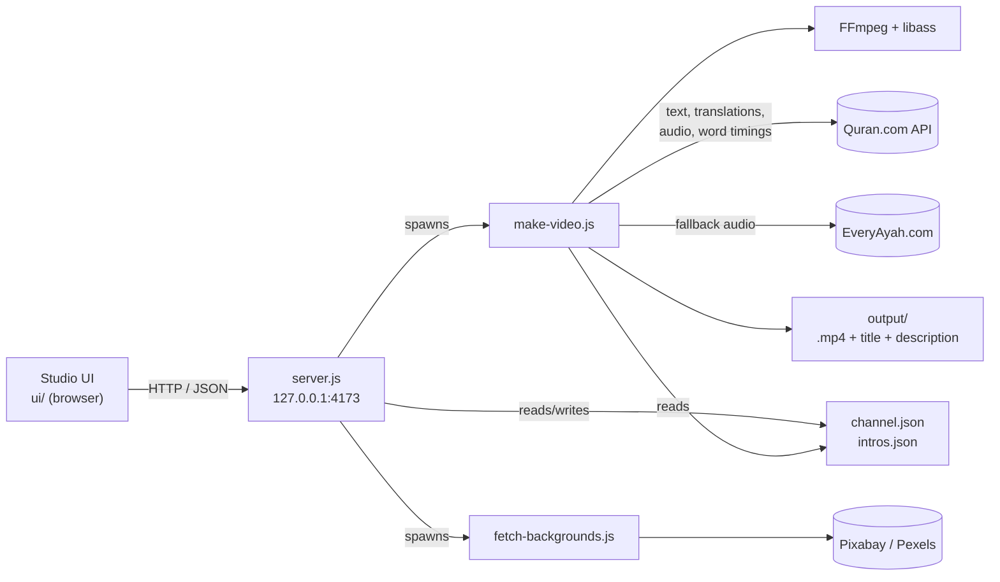
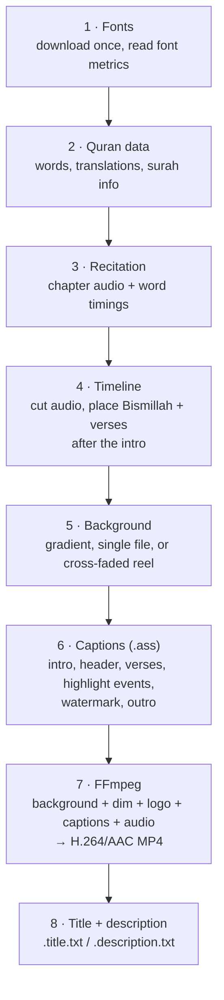
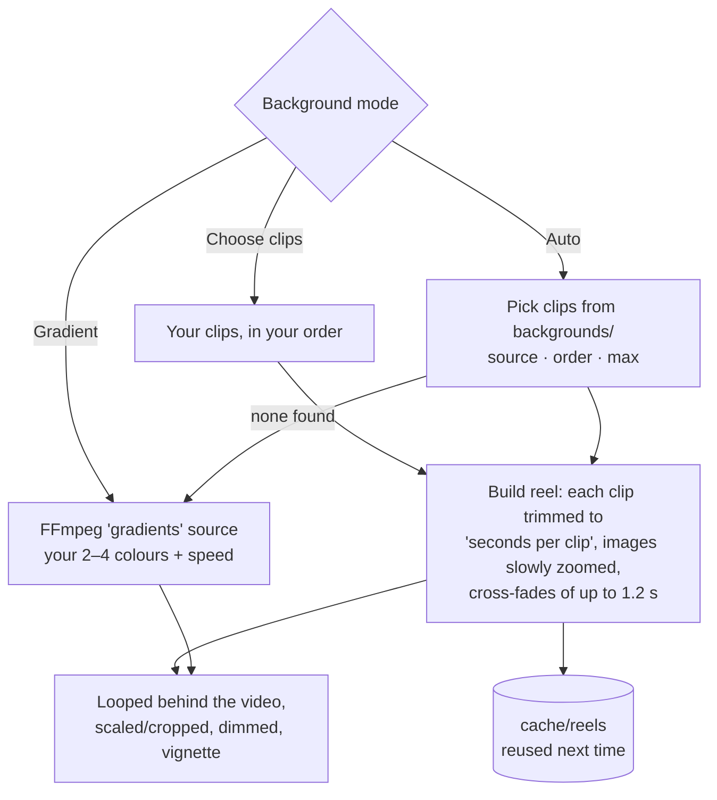

# Quran Video Studio

Make YouTube videos and Shorts of Quran recitation with synced captions — from a local web studio or the command line.

- **Arabic** (Uthmani script) with **word-by-word highlighting** that follows the reciter
- **English** and **Bangla** translations
- Branded **intro / outro** and a **watermark** (your logo or @handle)
- **Backgrounds**: your own clips/images or free stock footage, cross-faded, or an animated gradient
- **Batch Shorts**: one Short per verse of a surah
- **Caption style**: colours for every text element and adjustable text sizes, with a live preview that matches the render
- **YouTube-ready title and description** for every video

---

## Contents

1. [Quick start](#quick-start)
2. [Using the Studio](#using-the-studio)
3. [How it works](#how-it-works)
   - [Architecture](#architecture)
   - [Render pipeline](#render-pipeline)
   - [Word-by-word highlighting](#word-by-word-highlighting)
   - [Text size and fitting](#text-size-and-fitting)
   - [Backgrounds](#backgrounds)
   - [Batch Shorts](#batch-shorts)
   - [Preview frame](#preview-frame)
   - [Jobs and progress](#jobs-and-progress)
   - [Titles and descriptions](#titles-and-descriptions)
4. [Configuration](#configuration)
5. [Command line](#command-line)
6. [Project layout](#project-layout)
7. [Studio server API](#studio-server-api)
8. [Troubleshooting](#troubleshooting)
9. [Sources and credits](#sources-and-credits)

---

## Quick start

**Requirements**
- Node.js 18 or newer (no npm packages needed)
- FFmpeg — on Windows: `winget install Gyan.FFmpeg`

**Run the Studio**

```bash
npm start
```

Open **http://localhost:4173**. The Studio only listens on your own computer (127.0.0.1).

**Or render from the command line**

```bash
node make-video.js --surah 112
```

The video is written to `output/Videos/112 - Al-Ikhlas/112_1-4_alafasy.mp4`, with a `.title.txt` and `.description.txt` next to it (see [Where videos are saved](#where-videos-are-saved)).

Fonts (Amiri Quran, Hind Siliguri, Poppins) are downloaded automatically on the first render.

---

## Using the Studio

The Studio has four pages in the sidebar.

### Create

Work top to bottom on the left, check the result on the right, then render.

| Step | What you set |
|---|---|
| **1. Passage** | Surah (search by name, meaning or number), verse range, or a quick pick (Full surah, Ayat al-Kursi, End of Al-Baqarah, Al-Kahf 1–10, Al-Mulk). |
| **2. Recitation & translation** | Reciter (it tells you whether word timings exist), English and Bangla translation. |
| **3. Output** | **Single video** or **Short per verse**; format **Video 16:9** or **Short 9:16**; **Background** — see below. |
| **4. Features** | Word-by-word highlight, intro card, outro card, watermark, Bismillah, and **Bangla translation audio** (see below). |

**Bangla translation audio** reads each ayah's Bangla translation aloud right after the recitation:
*ayah → pause → Bangla translation → pause → next ayah*. While it plays, the Bangla line glows in the highlight colour.
Choose a voice — **Azure** (Nabanita / Pradeep, Bangladeshi accent, recommended), **Google** (Indian Bengali), or
**My recordings** (your own narration, one file per ayah) — set the speed and both pauses, and press **Test voice**
to hear it. Azure and Google need a free API key, entered in the panel and stored only in your browser.

**Background** has three modes:

- **Auto** — uses your clips automatically. Settings: *Use clips* (matching this format / all clips), *Order* (different start per surah / shuffle / by name), *Maximum clips*. A **Will use** strip shows exactly which clips will play.
- **Gradient** — an animated gradient. Pick 2–4 colours (picker or hex), a preset, and the animation speed.
- **Choose clips** — opens a picker: click clips to select them in play order (numbered), hover to preview them large with size, length and credit, filter by orientation/type, upload new clips. The chosen clips appear as a strip you can **drag** (or use **arrow keys**) to reorder.

For Auto and Choose clips you can also set **Seconds per clip** and **Dim background**. **Save background as default** stores these settings.

**Preview** (right side):

- **Live** — instant, in the browser, with the highlight walking through the words and the real background behind the text. It uses the same layout numbers as the renderer, so sizes and line breaks match the video.
- **Rendered frame** — an exact frame from the real renderer (about 2 seconds).

**Caption style**:

- **Text size** — sliders and −/+ buttons for Arabic, English and Bangla (50–200%). If a verse is too long for your sizes, a note says how much it was reduced to fit.
- **Colours** — presets or pickers for Arabic text, highlighted word, highlight glow, English, Bangla and verse reference.
- **Save as default** stores colours and sizes for future videos; **Reset** goes back to them.

Click **Render video** (or **Render Shorts**). A panel shows progress, the current step, a log, finished files and a **Cancel** button.

### Library

Every rendered video, newest first: play it, **copy the YouTube title or description**, download it or delete it. Each card shows its surah folder. Filter by Videos/Shorts or search.

### Where videos are saved

Videos are sorted by type and surah, so they're easy to find when uploading:

```
output/
├── Videos/
│   ├── 001 - Al-Fatihah/
│   │   ├── 001_1-7_alafasy.mp4
│   │   ├── 001_1-7_alafasy.title.txt
│   │   └── 001_1-7_alafasy.description.txt
│   └── 108 - Al-Kawthar/ …
└── Shorts/
    └── 112 - Al-Ikhlas/
        ├── 112_1_alafasy.mp4          one per verse with "Short per verse"
        ├── 112_2_alafasy.mp4
        └── …
```

File names are `<surah>_<verses>_<reciter>.mp4`. Folder numbers are zero-padded so folders sort in Quran order.

Videos rendered before this layout existed can be moved into it with:

```bash
node organize-output.js           # shows what would move
node organize-output.js --apply   # moves them (with their title/description files)
```

### Branding

Channel name, YouTube handle, subscribe line for descriptions, logo upload (drag and drop), and intro/outro lengths for videos and Shorts.

### Backgrounds

- **Download stock footage** from **Pixabay** (free API key) or **Pexels** (only if you already have a key — Pexels has paused new keys). Your key is stored only in your browser.
- **Upload your own** videos or images for videos (landscape) or Shorts (portrait).
- Browse, preview (hover to play) and remove clips.

---

## How it works

### Architecture



- **`make-video.js`** does all the real work and can be used on its own from the command line.
- **`server.js`** is a small Node HTTP server with no dependencies. It serves the UI, validates every option, turns it into command-line flags for `make-video.js`, runs one job at a time and reports progress.
- **`ui/`** is plain HTML/CSS/JS — no build step.
- Everything downloaded is cached in `cache/`, so re-rendering is fast.

### Render pipeline

What `make-video.js` does for each video:



1. **Fonts** — Amiri Quran (Arabic), Poppins (English, header), Hind Siliguri (Bangla) are downloaded from Google Fonts on first run. Their metrics are read from the font files (see [Text size](#text-size-and-fitting)).
2. **Quran data** — from the Quran.com API: each verse's Uthmani words, the chosen English and Bangla translations (footnote markers removed), juz, and surah info (Arabic name, meaning, place of revelation, summary).
3. **Recitation** — for reciters with word timings, Quran.com's gapless **chapter audio** plus **timestamps for every verse and word**. Most reciters come from the Quran.com v4 API; Yasser ad-Dossary and Khalifah Al Tunaiji only exist in Quran.com's newer audio API (`api.qurancdn.com`), which returns the same data under different field names. Maher al-Muaiqly has no word timings anywhere, so his audio comes as one MP3 per verse from EveryAyah.com and highlighting is off.
4. **Timeline** — the needed part of the chapter audio is cut to WAV. If the passage starts at verse 1 (and the surah isn't Al-Fatiha or At-Tawbah), the Bismillah is taken from Al-Fatiha 1:1 and placed first. Everything starts after the intro, and the outro is added at the end.
5. **Background** — see [Backgrounds](#backgrounds).
6. **Captions** — an Advanced SubStation (`.ass`) subtitle file with the intro card, surah header, every verse (Arabic + English + Bangla + reference), the highlight events, the text watermark and the outro card.
7. **FFmpeg** — combines background (scaled, cropped, dimmed, vignette), logo overlays, the captions (rendered by libass, which shapes Arabic and Bangla correctly) and the audio into an MP4 (H.264 + AAC, `faststart` for YouTube).
8. **Title and description** — written next to the video.

### Bangla translation audio

No source offers human Bangla narration split per ayah (EveryAyah, QuranicAudio and Quran.com have none), so the
spoken translation comes from one of three places:

| Voice | Source | Key |
|---|---|---|
| `azure:bn-BD-NabanitaNeural`, `azure:bn-BD-PradeepNeural` | Microsoft Azure neural speech (Bangladesh) | `AZURE_SPEECH_KEY` + `AZURE_SPEECH_REGION` — free tier 500k characters/month |
| `google:bn-IN-Wavenet-A`, `google:bn-IN-Wavenet-B` | Google Cloud Text-to-Speech (India) | `GOOGLE_TTS_API_KEY` |
| `files` | Your recordings: `translation-audio/bn/<NNN>/<NNNAAA>.mp3` (e.g. `112/112001.mp3`; Bismillah = `001/001001.mp3`) | none |

How it fits into the [render pipeline](#render-pipeline):

1. When the option is on, the recitation is cut **per ayah** (instead of one continuous cut).
2. After each ayah (and the Bismillah), the timeline adds: a pause → the spoken Bangla translation (exactly the text shown on screen) → a pause.
3. Synthesised speech is **cached** in `cache/tts/` by voice, speed and text, so re-rendering never calls the service — or bills you — twice.
4. The captions get an extra phase per ayah: from the end of the recitation until the next ayah, the Bangla line is drawn in the highlight colour with a glow.
5. The description adds a line naming the narration; synthetic voices are labelled **AI-generated voice**.

Preview frames never generate speech. Keys sent from the Studio are only passed to the render process's environment — never saved or logged.

### Word-by-word highlighting

Quran.com gives, for each verse, the time each word starts. Instead of one subtitle per verse, the renderer writes **one subtitle event per word**: the whole verse is drawn again with only that word in the highlight colour and glow. Because the text and layout are identical in every event, only the colour changes on screen.

Arabic needs two details to render correctly:
- the verse is wrapped in right-to-left embedding marks and the caption style uses libass's *whole-text layout*, so colour changes inside the line don't break word order;
- the verse number is drawn in ornate brackets: ﴿٧﴾.

### Text size and fitting

Sizes are set the way the browser sets them (by the font's **em**), so the live preview is the reference. libass sizes a font differently — so that the font's full line height (OS/2 `winAscent + winDescent`) equals the size — which would draw Amiri Quran about **2.8×**, Poppins **1.8×** and Hind Siliguri **1.6×** smaller. The renderer reads those values from the font files and converts each size, so the video matches the preview.

Each verse then goes through a **fit check**:

1. Start at your chosen sizes (default size × your Text size %).
2. Estimate how many lines the Arabic, English and Bangla will wrap to, using character widths and line heights measured from libass renders of these fonts, plus the gaps and reference label.
3. If the block is taller than the space allowed (80% of the frame for videos, 72% for Shorts, leaving room for YouTube's on-screen buttons), shrink all three together until it fits.

So your sizes are used exactly whenever the verse fits; only very long verses (e.g. Ayat al-Kursi, 2:282) are reduced. The Studio runs the same calculation with the same numbers (sent by the server) and tells you when a verse was reduced.

### Backgrounds



- **Auto** reads `backgrounds/landscape/` for videos or `backgrounds/portrait/` for Shorts (or every clip, if *Use clips* is "all"). With *Order: different start per surah* the reel starts at a different clip for each surah, so videos don't all look the same.
- Clips of the other shape are **centre-cropped**; the picker shows a dashed crop guide for this.
- The reel is cached under `cache/reels/` keyed by the clips and settings, and written atomically, so a cancelled render can't leave a broken reel.
- **Dim** darkens clips (0–90%) so captions stay readable.
- Stock footage credits are saved in `backgrounds/credits.json` and added to the description of any video that uses those clips.

### Batch Shorts

**Short per verse** (`--batch`) renders one 9:16 Short for every verse in the range into `output/Shorts/<NNN - Name>/`, each with its own title (`… #Shorts`) and description. With **Merge short verses** (`--group-seconds N`), consecutive verses are joined until each Short lasts at least N seconds. Shorts use the shorter intro/outro lengths from Branding.

### Preview frame

**Rendered frame** runs the real renderer for the first verse of your selection with `--still`, without intro/outro. To be fast, the video timestamps are shifted so the very first frame is already partway through the verse (a word is highlighted), so only one frame is drawn.

### Jobs and progress

The server runs one render (or background download) at a time:

1. `POST /api/render` validates the options and starts `make-video.js` with matching flags.
2. The server reads its output: steps (`• Rendering 2/4 …`), the video duration and FFmpeg's `time=` progress are turned into a percentage; finished files (`✓ …`) become links.
3. The page polls `GET /api/job` every 0.8 s. **Cancel** stops the whole process tree, including FFmpeg.

### Titles and descriptions

For every video:

- **`.title.txt`** — the surah name in **English and Bangla**, so the video is found by searches in either language:
  - video: `Surah Al-Ikhlas | সূরা আল-ইখলাস | Mishary Rashid Alafasy | Arabic, English & Bangla Translation`
  - Short: `Surah Al-Baqarah 2:255 | সূরা আল-বাকারা | The Cow ✨ #Shorts`

  YouTube allows 100 characters, so when a reciter name or verse range makes the title too long, the ending is shortened step by step (e.g. to `… | বাংলা অনুবাদ`). The Bangla name also appears in the description, as a hashtag (`#সূরা_আল_ইখলাস`) and on the intro card.
- **`.description.txt`** — an introduction, then 📖 surah · 📍 juz and verses · 🕋 place of revelation · 🎙️ reciter · 🌐 translators, your subscribe line and handle, background credits and hashtags.

The introduction comes from **`intros.json`** — keyed by surah (`"112"`) or by an exact verse/range (`"2:255"`, `"2:285-286"`). Surahs without an entry use the short summary from Quran.com (Tafhim al-Qur'an).

---

## Configuration

### `channel.json`

Everything the Studio's **Save as default** buttons and the Branding page write. All keys are optional.

```json
{
  "name": "Al-Bayaan Quran",
  "handle": "@Al-BayaanQuran",
  "logo": "assets/logo.jpg",
  "subscribeLine": "Subscribe for daily peaceful Quranic verses with verified English and Bengali translations.",
  "intro": { "long": 5, "short": 1.5 },
  "outro": { "long": 6, "short": 2.5 },
  "colors": {
    "arabic": "#FFD780", "highlight": "#FFFFFF", "glow": "#FFB400",
    "english": "#FFFFFF", "bangla": "#C8F0B4", "reference": "#A0A0A0"
  },
  "fontScale": { "arabic": 1, "english": 1, "bangla": 1 },
  "background": {
    "source": "match", "order": "rotate", "max": 12,
    "clipSeconds": 12, "dim": 0.55,
    "gradient": ["#0A1A24", "#14352B", "#1D1530"], "gradientSpeed": 2
  }
}
```

| Key | Meaning |
|---|---|
| `name`, `handle` | Shown in the intro/outro, watermark and description. |
| `logo` | Image path (relative to the project). Used as watermark and in the intro. Without it, the handle is a text watermark. |
| `subscribeLine` | Line in every description. |
| `intro`, `outro` | Seconds for videos (`long`) and Shorts (`short`); `0` turns them off. |
| `colors` | Caption colours (`#RRGGBB`). |
| `fontScale` | Text size multipliers, 0.5–2 (1 = 100%). |
| `background` | Default background settings (see [Backgrounds](#backgrounds)). |
| `translationAudio` | `{ "enabled", "voice", "rate", "pauseAfterAyah", "pauseAfterTranslation" }` — defaults for [Bangla translation audio](#bangla-translation-audio). Keys are never stored here. |

Precedence for every setting: **built-in default < `channel.json` < command-line flag** (the Studio sends flags for what you set on the page).

### `intros.json`

Opening paragraphs for descriptions:

```json
{
  "112": "Surah Al-Ikhlas (Chapter 112 of the Holy Quran) explains …",
  "2:255": "Ayat al-Kursi (Surah Al-Baqarah, verse 255) …"
}
```

---

## Command line

```bash
node make-video.js --surah 36                                     # Surah Ya-Sin, full, 16:9
node make-video.js --surah 2 --from 255 --to 255 --format short   # Ayat al-Kursi as a Short
node make-video.js --surah 67 --batch                             # one Short per verse of Al-Mulk
node make-video.js --surah 2 --from 1 --to 20 --batch --group-seconds 20
node make-video.js --surah 18 --reciter sudais --bg my-folder
node make-video.js --surah 1 --from 5 --still preview.png         # one frame, to check the look
```

| Option | Values | Default |
|---|---|---|
| `--surah` | 1–114 | required |
| `--from`, `--to` | verse range | whole surah |
| `--reciter` | alafasy, abdulbasit, abdulbasit-mujawwad, sudais, shatri, rifai, husary, minshawy, minshawy-mujawwad, shuraym, dossary, tunaiji, maher\* | alafasy |
| `--en` | saheeh, haleem, usmani, yusufali | saheeh |
| `--bn` | taisirul, mujibur, rawai, zakaria | taisirul |
| `--format` | `long` (1920×1080) or `short` (1080×1920) | long |
| `--batch` | one Short per verse → `output/Shorts/<NNN - Name>/` | |
| `--group-seconds` | with `--batch`: merge verses until each Short is ≥ n s | 0 |
| `--bg` | image, video or folder; repeat to cross-fade several files in order; or `gradient` | `backgrounds/` or gradient |
| `--bg-source` / `--bg-order` / `--bg-max` | Auto: `match`/`all` · `rotate`/`shuffle`/`name` · 1–40 | match · rotate · 12 |
| `--clip-seconds` / `--bg-dim` | seconds per clip (4–30) · darkening 0–0.9 | 12 · 0.55 |
| `--gradient` / `--gradient-speed` | 2–4 colours `"#0A1A24,#14352B,#1D1530"` · 0 (still)–10 | Night emerald · 2 |
| `--color-<name>` | `arabic`, `highlight`, `glow`, `english`, `bangla`, `reference` = `#RRGGBB` | see `channel.json` |
| `--size-<name>` | `arabic`, `english`, `bangla` = 0.5–2 | 1 |
| `--bn-audio` / `--no-bn-audio` | read the Bangla translation after each ayah | off |
| `--bn-voice` | `azure:bn-BD-NabanitaNeural`, `azure:bn-BD-PradeepNeural`, `google:bn-IN-Wavenet-A`, `google:bn-IN-Wavenet-B`, `files` | Nabanita |
| `--bn-rate` / `--bn-pause-ayah` / `--bn-pause-translation` | speed −40…40 % · seconds before · seconds after the translation (0–3) | 0 · 0.6 · 0.9 |
| `--still <file.png>` | render one preview frame of the first verse instead of a video | |
| `--out <file>` | output path (single video only) | `output/…` |
| `--no-highlight` `--no-intro` `--no-outro` `--no-watermark` `--no-bismillah` | turn features off | |

\* Maher al-Muaiqly has no word timings, so highlighting is off for him. All other reciters support word-by-word highlighting.

**Background downloads**

```powershell
$env:PIXABAY_API_KEY = "your_key"        # free: https://pixabay.com/api/docs/
node fetch-backgrounds.js                # mosques, Islamic architecture, desert, sky, ocean…
node fetch-backgrounds.js --query "masjid nabawi" --count 5 --orientation portrait
node fetch-backgrounds.js --provider pexels   # with $env:PEXELS_API_KEY
```

Review downloaded clips and delete any you don't want (e.g. ones showing people).

---

## Project layout

```
quran-channel/
├── make-video.js          Renderer (CLI + used by the server)
├── server.js              Studio web server
├── fetch-backgrounds.js   Stock footage downloader (Pixabay / Pexels)
├── ui/                    Studio front end (index.html, styles.css, app.js)
├── channel.json           Branding and default style
├── intros.json            Description introductions
├── surah-names-bn.json    Bangla surah names (114, in order) for titles, descriptions and the intro card
├── organize-output.js     Moves older renders into output/Videos and output/Shorts
├── translation-audio/     Your own Bangla narration recordings (optional)                       [git-ignored]
├── assets/                Uploaded logo
├── backgrounds/           Your clips: landscape/ (videos), portrait/ (Shorts), credits.json   [git-ignored]
├── output/                Videos/<NNN - Name>/ and Shorts/<NNN - Name>/ with .title/.description [git-ignored]
├── fonts/                 Downloaded fonts                                                      [git-ignored]
└── cache/                 API responses, audio, reels, thumbnails, previews, work files        [git-ignored]
```

---

## Studio server API

All endpoints are local only (`127.0.0.1`).

| Method & path | Purpose |
|---|---|
| `GET /api/meta` | Reciters, translations, surah list, defaults, saved channel settings, layout numbers for the preview |
| `GET /api/verse?surah=&verse=&en=&bn=` | One verse's words and translations (for the live preview) |
| `POST /api/render` | Start a render job (options as JSON) |
| `POST /api/preview` | Render one exact frame; returns its URL |
| `GET /api/job` · `POST /api/job/cancel` | Current job status/log · cancel it |
| `GET /api/library` · `DELETE /api/library?id=` | Rendered videos with titles/descriptions · delete one |
| `PUT /api/channel` | Save branding, colours, text sizes or background defaults |
| `POST /api/logo` · `DELETE /api/logo` | Upload / remove the logo |
| `GET /api/backgrounds` · `DELETE /api/backgrounds?id=` | Clips with size, length, credit · remove one |
| `GET /api/backgrounds/thumb?id=` | Cached JPEG thumbnail |
| `POST /api/backgrounds/upload?orientation=&name=` | Upload a clip |
| `POST /api/backgrounds/fetch` | Download stock footage (job) |
| `GET /media/<output\|previews\|assets\|backgrounds>/…` | Files, with range requests for video seeking |

---

## Troubleshooting

| Problem | Fix |
|---|---|
| **"Port 4173 is already in use"** | The Studio is already running — open http://localhost:4173, or stop the other one. Another port: `$env:PORT=4174; npm start`. |
| **Changes don't show after updating** | Restart the Studio (Ctrl+C, then `npm start`) and reload the page. |
| **"FFmpeg missing"** in the sidebar | `winget install Gyan.FFmpeg`, then restart the Studio. |
| **Pexels: "New API key issuance is paused"** | Use Pixabay instead, or download clips by hand and use **Upload your own**. |
| **Text on a long verse doesn't get bigger** | It already fills the screen; the note under Text size shows how much it was reduced to fit. |
| **No word highlighting** | The reciter has no word timings (Maher al-Muaiqly), or the feature is switched off. |
| **"Azure speech error 401"** | Wrong key or region. The region is the one shown on your Speech resource (e.g. `southeastasia`). |
| **"Missing recording: translation-audio/bn/…"** | With *My recordings*, every ayah in the range (and `001/001001.mp3` for the Bismillah) needs a file. |

---

## Sources and credits

- Quran text, translations, recitation audio and word timings: [Quran.com API](https://api.quran.com)
- Fallback verse audio: [EveryAyah.com](https://everyayah.com)
- Fonts: [Amiri Quran](https://fonts.google.com/specimen/Amiri+Quran), [Hind Siliguri](https://fonts.google.com/specimen/Hind+Siliguri), [Poppins](https://fonts.google.com/specimen/Poppins) (SIL Open Font License)
- Background footage: [Pixabay](https://pixabay.com) / [Pexels](https://www.pexels.com) — free to use; credits are added to descriptions automatically

Check each reciter's and publisher's terms before monetising videos.
